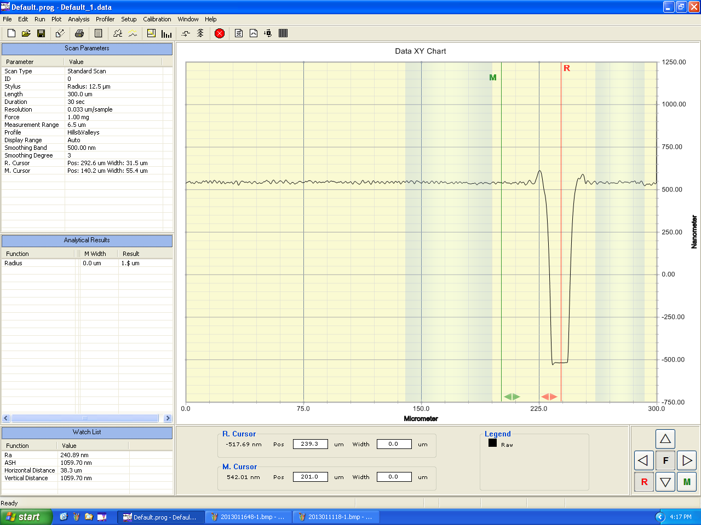
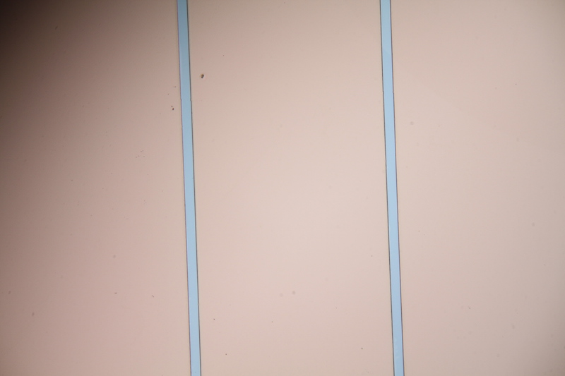
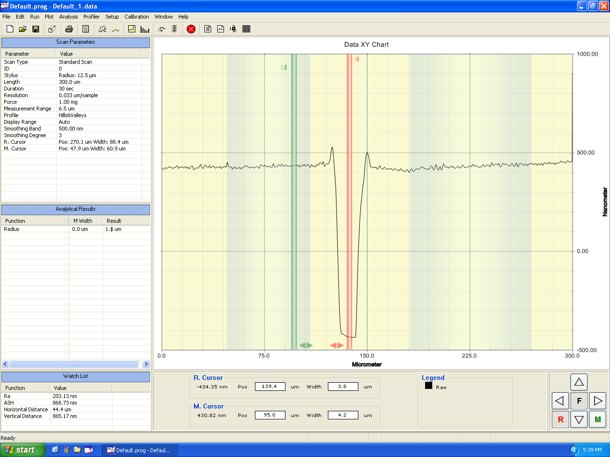
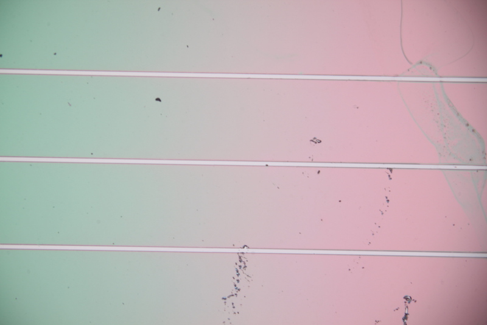
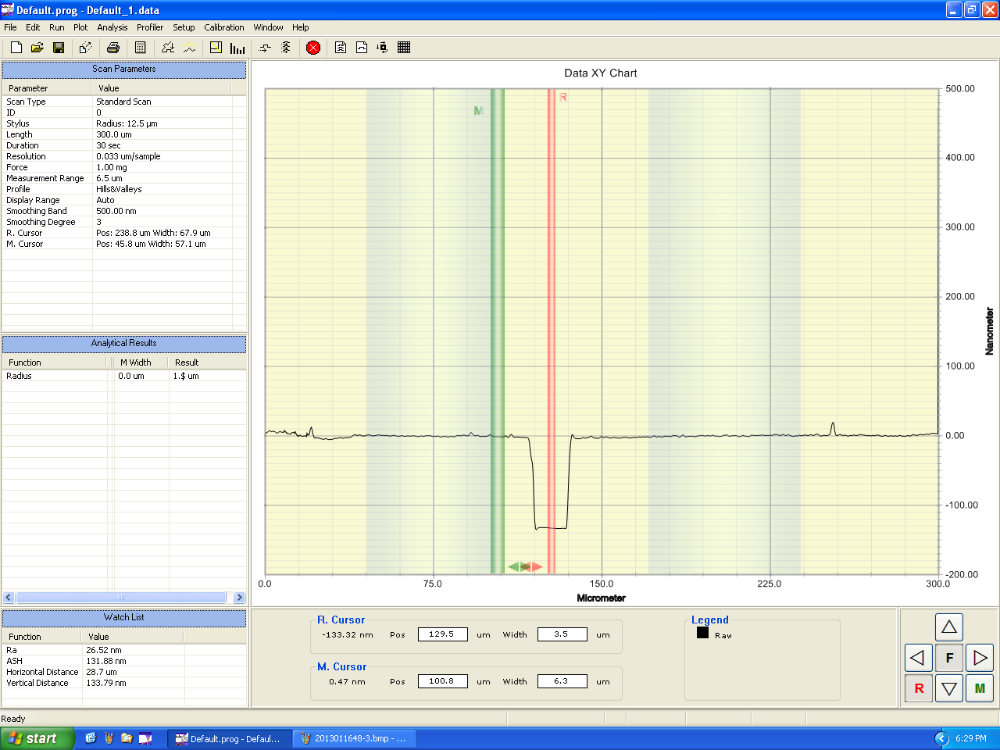
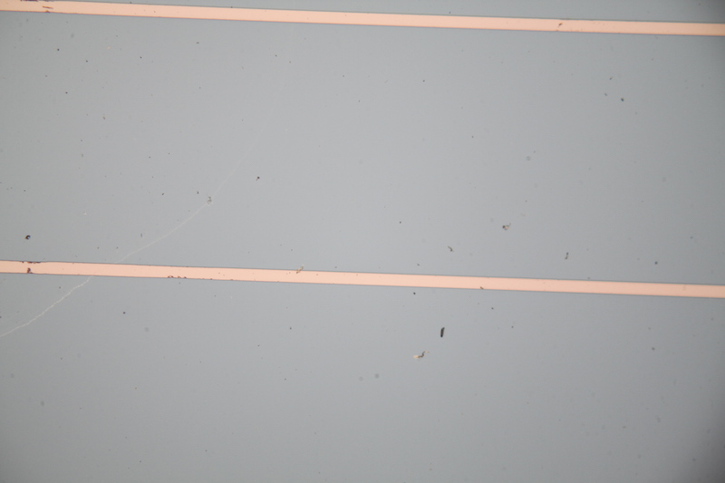

# 实验一 反应离子刻蚀工艺及其半导体激光器工艺应用

姓名：李思涵

班级：无36

学号：2013011187

## 实验目的

1. 了解反应离子刻蚀过程的物理原理
2. 了解真空获取的方式及相关设备的基本结构
3. 了解半导体异质结激光器的物理原理和基本结构
4. 熟悉半导体异质结激光器的制作工艺过程

## 实验原理

### 反应离子刻蚀过程

### 半导体异质结激光器

激光器至少包括以下三个部分：

1. **增益介质**，通过受激辐射的方式产生光放大；
2. **汞浦源**，可以使增益介质中产生粒子束反转；
3. **两个镜面构成谐振腔**，使光限制在其中并不断地反复行进。

而对于半导体激光器：

1. **使用半导体材料作为增益介质**，利用直接带隙材料的受激辐射进行放大；
2. **采用PN结正向注入进行电汞浦**;
3. **采用解理面构成谐振腔**。

## 实验步骤

## 数据记录与处理

### 初始样片（带有光刻胶掩膜）

#### 测量

- 厚度：1056.91 nm
- 宽度：13.5 µm

#### 显微镜下

### 刻蚀后

#### 反应条件

- 气体：SF6
- 流量：50 sccm
- 压强：5 Pa
- RF 功率：100 w
- 时间：3 分 45 秒

#### 测量

- 厚度：862.23 nm
- 宽度：15.1 µm

#### 显微镜下

### 清除光刻胶后

#### 测量

- 厚度：133.79 nm
- 宽度：15.6 µm

#### 显微镜下

## 思考题
