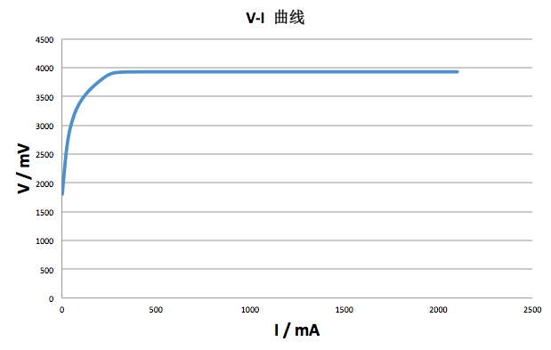
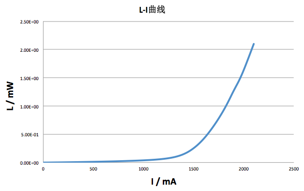

# 实验二 功能薄膜的制备与红光 LD 特性评测

- 姓名：李思涵
- 班级：无36
- 学号：2013011187

## 实验目的

1. 了解功能薄膜在半导体光电子器件中的重要作用；
2. 掌握功能薄膜的分类及常规的制备方法；
3. 掌握电子束蒸发制备功能薄膜的基本原理；
4. 了解膜厚实时监控的基本原理；
5. 掌握电子束蒸发设备的实际操作，获得具有特定功能的薄膜材料并进行特性测试；
6. 掌握合金化的原理；
7. 掌握红光激光器的解理方法和半导体激光器性能的评测方法。

## 实验原理

### 电子束蒸发

在电子束蒸发制备过程中，被加热物质放于水冷的坩埚中，电子束只轰击其中很少一部分物质，而其余的大部分物质在坩埚冷却作用下一直处于低温，即后者实际上变成了被蒸发物质的坩埚。因此．电子束蒸发沉积可避免坩埚材料的污染。在同一蒸发沉积装置中可以安置多个坩埚，可同时或分别蒸发和沉积多种不同物质。

值得注意的是，除了电子枪操作本身，实际上为获得高质量的功能薄膜，还需注意：一是提高本底真空度。二是衬底加热，可去除晶片表面吸附的杂质，并获得干燥清洁的表面。三是预蒸，将源中蒸汽压高的杂志挥发掉，提高源的纯度。四是功能薄膜厚度的实时准确监控。

### 半导体激光器的解理

半导体材料具有各向异性的特点。对于 GaAs 材料来说，(110) 晶面可以通过解理，形成非常完美的平行反射和透射端面，从而构成谐振腔。

解理时，先将晶片用一次性透明塑料固定，然后用金刚刀轻轻地在需要解理的部位划出一个小口子，
然后用手术刀轻压晶片背面使之自然解理，从而获得激光器的一个反射面。照此方法处理另一个端面。

## 实验步骤

1. 利用电子束蒸发系统制备 Ti (20 nm)/Au (200 nm) 电极；
2. 解理半导体激光器，对其特性进行测试，给出 I-V 特性，L-I 特性曲线，计算包括阈值电流、微分电阻、斜率效率、输出功率等参数；
3. 对解理后的半导体激光器进行合金化，研究退火温度、时间与半导体激光器阈值电流、微分电阻、斜率效率和输出功率的关系；
4. 总结实验过程中观察到的物理现象，并对其进行解释。

## 数据记录与处理

因第一块半导体激光器效果较好，选择其的测量结果进行分析。

### V-I 曲线

### L-I 曲线

### 参数

- 阈值电流：1483.8 mA
- 微分电阻：0 Ω
- 斜率效率：3.04E-03
- 输出功率：2.100 mW

### 退火温度、时间与半导体激光器阈值电流、微分电阻、斜率效率和输出功率的关系

若退火温度较高，时间较长，则可能导致大量杂质扩散，使得阈值电流增大，斜率效应和输出功率降低，
杂质的增多也会改变其微分电阻。

### 总结物理现象

- 在制备功能薄膜时，可以从仪器上的小窗看到仪器内发出了耀眼的光。这是因为坩埚中的源（Ti / Au）
  在加速电子束的轰击下融化了，从而发出了金色的光。

- 在对制作出的激光器进行测试时，开始时激光器基本不发光。然而，当电流增大到一定大小时，
  激光的光强会迅速增大，一下子变得很耀眼。这是因为半导体激光器存在一个电流阈值。
  当电流小于这个值的时候，激光器发出的并不是激光，可以看做普通 LED。而当电流超过过阈值后，
  激光器才可以发出真正的激光。

## 思考题

### 如果将坩埚内的源全部蒸发完毕，根据坩埚与样品之间的距离，如何估算样品上的薄膜厚度？

假设源向各个方向均匀蒸发，则可以考虑样片所对应的，以坩埚为球心的空间角。

假设源的质量为 m，密度为 ρ，样片据坩埚距离为 r，与坩埚竖直方向夹角为 θ，则有

    d = m cosθ / (4πr^2 * ρ)

### 要与半导体材料形成欧姆，对材料的要求是什么？常常采用哪些措施？

对材料有如下要求：

- 表面吸附的杂质较少，采取的方式是在真空中进行退火过程；
- 焊接点能牢牢地固定在芯片上，采取的方法是热压或超声键合。

### 红光半导体激光器要成为光盘读写装置或激光指示器，还需要做哪些工作？

首先，半导体激光器需要外部电源才能发光，故需要安装合适的电源

其次，为了能够调整激光的宽度，还应该在激光发射处安装透镜，从而调整激光光斑的大小。

## 实验总结

这次实验是接在上一次实验之后做的，可以说应该算是同一个实验。

这次实验的一个难点在于解理操作。由于晶片十分脆弱，只要稍有不慎，解理操作中晶片便会四分五裂。
而若是解理形成的解理面不是特别好，也会使得最后形成的激光器性能较差。

当然最开心的事情，当然还是看到自己制作的激光器发出耀眼的激光啦~
